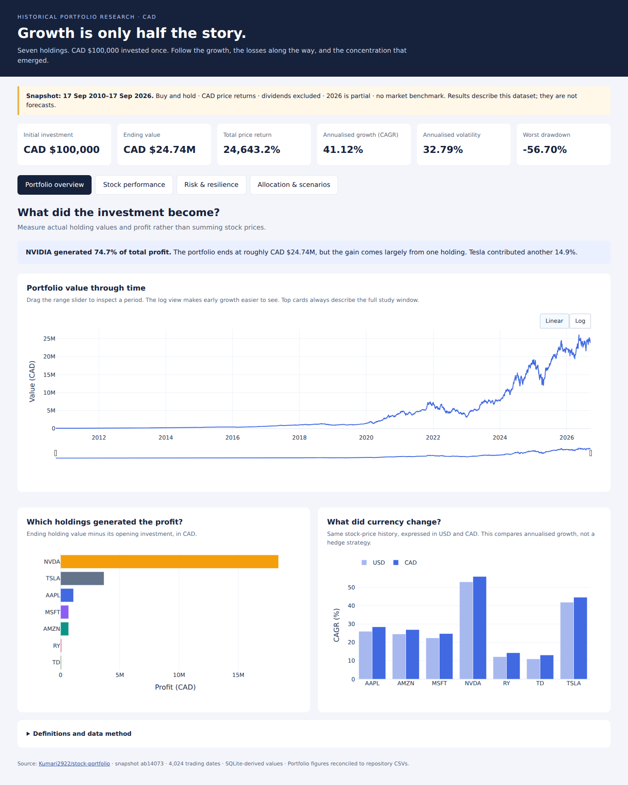

# Stock-Portfolio
An end-to-end Finance Data Analyst portfolio project from data collection through analysis, database design, and dashboard reporting

## Interactive dashboards

The [dashboard](dashboards/stock_portfolio_dashboard.html) contains four pages:
portfolio overview, stock performance, risk and resilience, and allocation
scenarios. Download the repository, then open that HTML file in a browser.
It works offline; GitHub's file page does not execute the interactive dashboard.



- [Project explanation and database access](dashboards/PROJECT_EXPLAINED.md)
- [Power BI data model, measures and page layouts](dashboards/POWER_BI_GUIDE.md)
- [SQL examples](dashboards/explore_database.sql)
- [Screenshots of all four dashboard pages](dashboards/screenshots/dashboard_preview.png)

The dashboard reads the committed SQLite snapshot at
`data/processed/stock_portfolio.db`. It models CAD $100,000 invested in seven
stocks from 17 September 2010 to 17 September 2026, using fixed holdings and
CAD price returns. Dividends are excluded and no market benchmark is included.

To regenerate the dashboard and Power BI CSV exports after updating the database:

```bash
pip install -r dashboards/requirements.txt
python dashboards/build_dashboard.py
```

The builder opens SQLite read-only and reconciles its calculations with the
repository's processed metric outputs. The original Power BI `.pbix` is a
separate report; it is not modified by the builder.


