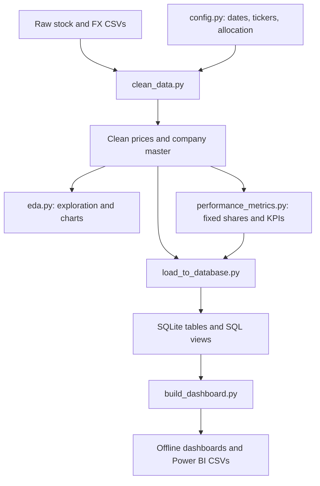

# Stock portfolio project, explained

Reviewed snapshot: `ab14073f1ac3f6d3b1e61cfbb6ae2a726047f610` on `main`.
Repository: https://github.com/Kumari2922/stock-portfolio

## 1. What you are doing

You are running a historical investment simulation. Imagine putting CAD $100,000 into seven stocks on 17 September 2010 and leaving the holdings alone until 17 September 2026. The project calculates what that money became, which holdings generated the profit, how severe the losses were along the way, and how the portfolio's balance changed.

This is a hypothetical portfolio. It is not your brokerage account, a trading bot, or a forecast of future returns. All figures below describe the repository's historical data snapshot. I reconciled the calculations inside that snapshot; I did not independently audit its market-price provenance or split adjustments.

| Holding | Starting investment CAD | Starting weight |
|---|---:|---:|
| Apple / AAPL | 20,000 | 20% |
| Microsoft / MSFT | 20,000 | 20% |
| NVIDIA / NVDA | 15,000 | 15% |
| Amazon / AMZN | 15,000 | 15% |
| Tesla / TSLA | 10,000 | 10% |
| Royal Bank / RY | 10,000 | 10% |
| TD Bank / TD | 10,000 | 10% |
| Total | 100,000 | 100% |

Shopify exists in the raw and cleaned data, but is excluded from the scoped portfolio. The RY and TD price files are US listings. Do not reintroduce the spreadsheet tickers `RY.TO` and `TD.TO` into joins: the database uses `RY` and `TD`.

## 2. What questions are you answering?

These are the ten questions in the scope document, mapped to a useful visual.

| Question | Plain meaning | Dashboard evidence |
|---|---|---|
| 1. Which stock generated the highest return? | Which grew the most per dollar invested? | Stock results table, indexed stock growth |
| 2. Which stock had the highest risk? | Which had the most variable returns or deepest losses? | Volatility vs CAGR, drawdown columns |
| 3. What was the overall portfolio return? | What did the full CAD $100,000 become? | Portfolio value line, total return and CAGR cards |
| 4. Which sector performed best? | How did your technology, consumer, and banking holdings compare? | Sector summary export, sector weights, stock results |
| 5. Which investment contributed most to growth? | Which contributed the most actual CAD profit? | Profit by holding; contribution figures |
| 6. How did prices change over time? | What happened along the journey? | Indexed CAD stock growth, annual return heatmap |
| 7. Which stocks consistently outperformed? | Did a stock have strong results repeatedly? | Positive full years and years beating this portfolio |
| 8. How did major events affect the portfolio? | What losses and recoveries occurred around selected periods? | Drawdown period controls for 2020 and 2022–2023 |
| 9. Which stocks offered the best risk-return balance? | How much growth came with volatility? | CAGR/volatility scatter, Sharpe ratios |
| 10. How would allocation affect growth? | Would different starting weights change the outcome? | Opening/ending weight charts and live allocation scenario |

Question 7 cannot establish market outperformance because there is no market benchmark. The dashboard explicitly compares a stock with this portfolio, which itself contains that stock. Question 8 describes observed behaviour around chosen windows; it does not prove which event caused a move. A causal explanation would need dated external evidence.

The sector comparison concerns these selected holdings, not every company in each sector. Your sample cannot support a claim that the entire technology sector outperformed the entire banking sector.

## 3. The main results and what they mean

| Metric | Result |
|---|---:|
| Ending value, 17 September 2026 | CAD 24,743,195.57 |
| Profit | CAD 24,643,195.57 |
| Total CAD price return | 24,643.20% |
| Annualised growth / CAGR | 41.12% |
| Annualised portfolio volatility | 32.79% |
| Sharpe ratio, 3% risk-free assumption | 1.126 |
| Maximum portfolio drawdown | -56.70% |
| Date of deepest drawdown | 5 January 2023 |

The useful story is **concentration**, not just the impressive ending number. NVIDIA began at 15% of the portfolio, finished at 74.44%, and contributed 74.68% of total profit. Tesla contributed another 14.88%. Together they generated about 89.56% of the profit.

NVIDIA had the highest percentage return and highest Sharpe ratio in this sample. Tesla had the highest volatility, about 56.45%, and a maximum drawdown of roughly -71.07%. TD had the lowest price return. That does not mean TD was a bad investment: dividends are missing, which matters particularly for banks.

Technology's actual holdings grew CAD 55,000 to about CAD 20.22M, a 36,665% price return. Consumer discretionary grew CAD 25,000 to CAD 4.36M, a 17,357% return. Banking grew CAD 20,000 to CAD 157,879, a 689% return. Technology's final weight was about 81.72%; banking's was about 0.64%.

A -56.7% drawdown means the portfolio was worth 56.7% less than its earlier highest value, even though it later finished far above its starting investment. A profitable ending does not erase the losses experienced during the holding period.

## 4. How the data moves



The existing Power BI file references `stock_prices_clean` and `company_master` in its report definitions. That suggests a CSV-based model. The compressed semantic model was not decoded here, so its precise original connection paths and refresh configuration remain unverified. SQL views existing in the repository does not prove that this PBIX is connected to them.

### The Python scripts

| Script | Purpose |
|---|---|
| `python/config.py` | One place for the date window, paths, tickers, opening investments, CAD convention, trading days/year, and risk-free assumption. |
| `python/clean_data.py` | Reads raw prices, cleans rows, limits the study window, joins FX, converts USD prices to CAD, and adds company/sector information. |
| `python/eda.py` | Explores stock returns, annual/monthly results, correlation, sector baskets, volatility, volume, and currency effects. Produces charts and tables. |
| `python/performance_metrics.py` | Calculates fixed share counts, portfolio values, stock/portfolio risk, profit, weights, and actual holding-weighted sector results. |
| `python/load_to_database.py` | Loads processed prices and companies plus holdings derived from performance metrics into SQLite. Normalises tickers, checks joins, and creates SQL views. |
| `python/viz_style.py` | Shared formatting for the existing matplotlib charts. |
| `python/stock.py` | A placeholder, not the portfolio calculation engine. |
| `dashboards/build_dashboard.py` | New: reads SQLite without modifying it, reconciles results, builds the offline HTML dashboard, and exports Power BI CSVs. |

### The processed CSV files

| File | One row means | Why it matters |
|---|---|---|
| `company_master.csv` | One company, including SHOP | Descriptive information and portfolio membership; join on ticker. |
| `stock_prices_clean.csv` | One ticker on one trading date | Core historical observations. Includes CAD close, original USD close, FX rate and volume. |
| `stock_metrics.csv` | One stock | Stock-level historical statistics; SHOP uses a shorter history and must not silently enter portfolio comparisons. |
| `monthly_returns.csv` | One stock/month | Month-end return from previous month-end. |
| `annual_returns.csv` | One stock/year | Year-end return from previous year-end; 2026 is partial. |
| `correlation_matrix.csv` | One stock against each stock | Co-movement of daily CAD returns for the seven portfolio holdings. |
| `sector_summary.csv` | One sector basket | EDA equal-weight sector baskets. These differ from the actual investment allocations. |
| `metrics/portfolio_value_daily.csv` | One trading date | Total and holding values, profit, daily return, and drawdown for the actual portfolio. |
| `metrics/portfolio_summary.csv` | One metric/value pair | Headline portfolio KPIs. It is not a normal one-row-wide table. |
| `metrics/stock_performance_summary.csv` | One portfolio holding | Shares, purchase price, value, profit, return, volatility, Sharpe and ranks. |
| `metrics/portfolio_weights.csv` | One portfolio holding | Starting and ending weights and share of total profit. |
| `metrics/portfolio_sector_summary.csv` | One actual portfolio sector | Investment-weighted sector value and growth. Use this for the actual portfolio story. |

## 5. The calculations, with an example

Assume CAD $10,000 buys a stock at CAD $50:

1. **Shares = investment / starting close:** 10,000 / 50 = 200 shares.
2. If the close later becomes CAD $75, **value = shares × close:** 200 × 75 = CAD $15,000.
3. **Profit = value − investment:** 15,000 − 10,000 = CAD $5,000.
4. **Total return = profit / investment:** 5,000 / 10,000 = 50%.
5. The portfolio value adds that calculation across all seven stocks.

The repository uses historical split-adjusted prices and fractional share units as a modelling convention. This is not a literal reconstruction of trade confirmations and split transactions.

**CAGR** turns the full start-to-end growth into a constant equivalent annual rate. It is different from the arithmetic average of annual returns. **Volatility** measures how variable daily percentage returns were. **Sharpe** compares average return above an assumed risk-free rate with volatility. **Maximum drawdown** finds the largest fall below any earlier peak. **Profit contribution** divides each holding's profit by total profit; it is different from its ending weight.

Currency conversion is `CAD close = USD close × USD/CAD`. A USD $100 price at 1.35 CAD/USD becomes CAD $135. Even if the USD price does not move, a changing exchange rate changes the CAD value.

For a missing quotation, the portfolio uses the most recent available earlier close. Otherwise, summing only available rows would briefly remove a holding and create a false crash. The SQL daily-value view implements the same carry-forward convention.

## 6. Your database and SQL connection

The actual database is **`data/processed/stock_portfolio.db`**, a SQLite file already committed to GitHub. It is not MySQL, PostgreSQL, or a remote server. No hostname, username or password is configured for this local file. SQLite stores a database in a disk file and supports read-only connections.

| Object | Rows in reviewed snapshot | What it contains |
|---|---:|---|
| `Stock_Prices` table | 31,013 | Daily cleaned observations for eight stocks, including SHOP. |
| `Company_Master` table | 8 | Company metadata keyed by ticker. |
| `Portfolio` table | 7 | Ticker, fixed shares, purchase price and initial amount. |
| `v_portfolio_daily` view | 4,024 | Date and summed portfolio value, including carry-forward prices. |
| `v_holdings_current` view | 7 | Latest holding values and profits. “Current” means latest in this file. |
| `v_stock_daily_returns` view | 28,165 | Daily returns for portfolio stocks; first observation per stock has NULL return. |
| `v_stock_annual_returns` view | 119 | 17 years × 7 holdings, including NULL return for first year. |

A **table** stores data. A **view** is a saved SELECT query evaluated when read. A **SQL file** stores instructions, not the underlying database.

`Stock_Prices.ticker` joins to `Company_Master.ticker` and `Portfolio.Ticker`. One company has many daily prices; one holding belongs to one company. The loader checks that all seven holdings join. It loads the holdings from Step 5 so the fixed share counts agree with the Python analysis. The raw allocation spreadsheet is cross-checked, rather than used directly as the holdings table.

| SQL file | Role |
|---|---|
| `SQL/views.sql` | Defines the four reusable views above; the loader executes it. |
| `SQL/portfolio_analysis.sql` | Exploratory SELECT queries for portfolio values and allocations. |
| `SQL/kpi_analysis.sql` | More detailed KPI queries. |
| `dashboards/explore_database.sql` | New: short, readable queries to inspect your tables and results. |

### Open it visually on Windows

1. Download/extract the repository using GitHub **Code → Download ZIP**, or use your existing local clone.
2. Open [DB Browser for SQLite](https://sqlitebrowser.org/).
3. Choose **Open Database** and select `data/processed/stock_portfolio.db` inside your extracted repository.
4. Use **Browse Data** to see a table or view. Start with `Portfolio`, then `Stock_Prices`, then `v_holdings_current`.
5. Use **Execute SQL** to run the SELECT statements below or open `dashboards/explore_database.sql`.

The database file must be downloaded locally. The GitHub webpage displaying it is not a database connection.

```sql
-- The seven holdings, fixed shares and original amounts.
SELECT * FROM Portfolio;

-- Latest values and profit.
SELECT ticker, sector, investment_cad, current_value_cad, profit_loss_cad
FROM v_holdings_current
ORDER BY profit_loss_cad DESC;

-- Portfolio value at the end of the available history.
SELECT date, portfolio_value
FROM v_portfolio_daily
ORDER BY date DESC LIMIT 1;
```

### Open it from Python without changing it

Run from the repository root:

```python
import sqlite3
from pathlib import Path
import pandas as pd

db = Path('data/processed/stock_portfolio.db').resolve()
with sqlite3.connect(db.as_uri() + '?mode=ro', uri=True) as conn:
    result = pd.read_sql_query('SELECT * FROM v_holdings_current', conn)
print(result)
```

### How Power BI can read the data

Power BI Desktop supports Text/CSV and generic ODBC data sources. For this deliverable, the direct route is to import the files in `dashboards/powerbi_data/`; see `POWER_BI_GUIDE.md` for relationships, measures and page layouts. This avoids needing a SQLite driver.

For a direct database connection, a compatible SQLite ODBC driver is required. Configure a local data source pointing at `stock_portfolio.db`, then use **Get Data → ODBC** in Power BI. Driver names/settings depend on your installed driver; no driver is bundled here. A published Power BI report refreshing a local file needs a refresh arrangement such as a configured gateway. The offline HTML does not need ODBC or Power BI.

## 7. What was wrong or incomplete in the existing dashboard?

`reports/stock_portfolio_dashboard.pbix` contains one page with four visuals: a ticker slicer, investment card, sector investment donut and stock-price line. The line groups the date hierarchy by year and applies SUM to the daily `close` values. Summed daily prices are not annual return or portfolio value: the number also depends on how many trading observations are in a group.

Use daily `portfolio_value` for portfolio growth; indexed stock prices for comparable stock growth; and previous year-end to current year-end percentage change for annual returns. The new dashboard uses these definitions. The original PBIX was inspected but not edited, refreshed or executed in Power BI Desktop.

## 8. How to use the new dashboards

Double-click `stock_portfolio_dashboard.html` in a browser. It is self-contained and works offline; no Python installation is needed to view it.

1. **Portfolio overview:** ending wealth, CAD profit contribution, value over time, USD/CAD growth comparison.
2. **Stock performance:** comparable indexed growth, annual returns, consistent positive years, full holding results.
3. **Risk & resilience:** risk-return scatter, portfolio drawdowns and return correlations.
4. **Allocation & scenarios:** opening vs ending weights, sector concentration, adjustable starting weights.

The scenario uses the same prices, dates and CAD $100,000 starting capital. Positive weights are normalised to 100%. “Exclude NVIDIA” reallocates its initial allocation proportionally to the other original holdings. “Equal weights” invests the same opening amount in each of seven stocks. These are changes to the opening allocation, not periodic rebalancing. Export the scenario as CSV using its button.

Top cards remain full-period metrics even when you zoom a chart. Scenario cards describe the selected opening weights. Hover charts for details; use chart export buttons for PNG images.

### Regenerate after data updates

From the repository root:

```bash
pip install -r requirements.txt
pip install plotly
python python/clean_data.py
python python/eda.py
python python/performance_metrics.py
python python/load_to_database.py
python dashboards/build_dashboard.py
```

The first four scripts update the processed files and rebuild the database, replacing its tables. Run them on your working copy when you intend to refresh the pipeline. Viewing the new dashboard and running its builder do not change the database. Opening Power BI requires refreshing its own sources separately.

## 9. Checks and limits

The builder reconciles the exact portfolio value, CAGR, volatility and drawdown with the committed Python metric outputs. It checks portfolio membership, database integrity, starting capital, holding-value sums, weights summing to 100%, and default/single-stock scenario arithmetic. The reviewed daily SQL values differ from exact-share calculations by at most CAD $0.0125 because the database holds share counts rounded to four decimals. This is immaterial for the headline results and is documented rather than hidden.

The dashboard omits unsupported claims: there is no market benchmark; no dividend reinvestment, fees, taxes or cash-flow data; no causal event model; and no evidence these allocations would work in future. All seven stocks were selected with historical outcomes known. The source says the data is split-adjusted, but adjustment provenance was not independently audited. Bank trading volumes cover US listings, not all trading venues. Keep these limits in your interview explanation.

An accurate presentation line: **“I analysed a hypothetical CAD buy-and-hold portfolio, built a reproducible Python-to-SQLite pipeline, and used dashboards to show growth, drawdowns, contribution and concentration. NVIDIA generated most of the historical profit, while its weight drift exposed the portfolio to one dominant holding.”**

## Reference documentation

- SQLite file storage: https://www.sqlite.org/onefile.html
- SQLite read-only URI: https://www.sqlite.org/uri.html
- DB Browser for SQLite: https://sqlitebrowser.org/
- Power BI Desktop data sources: https://learn.microsoft.com/power-bi/connect-data/desktop-data-sources
- Project scope: `KPIs and Business Questions/Project_Scope_QA.pdf`
- Project methods: `python/config.py`, `python/performance_metrics.py`, `python/load_to_database.py`, `SQL/views.sql`
